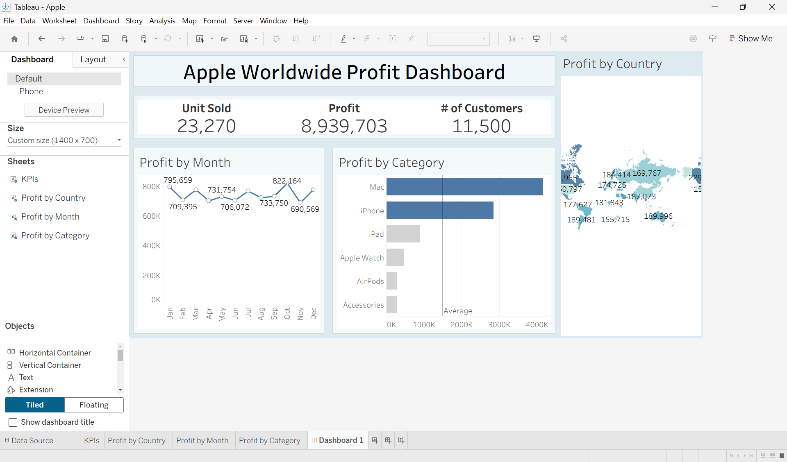

# Apple Sales Analysis Tableau 📊

This is my first Tableau portfolio project, using the **"Apple Global Sales Dataset"** from Kaggle.  
The dashboard provides insights into Apple’s global sales performance, profitability trends, and product performance across different regions.

---

## 🚀 Project Overview
This Tableau project analyzes Apple’s global sales performance to identify key drivers of profit and understand how product categories and geographic regions contribute to overall revenue.  
The dashboard helps visualize trends, compare performance across products, and evaluate market presence worldwide.

---

## 📊 Dashboard Preview

---

## 📈 Key Metrics
- **Total Units Sold:** 23,270  
- **Total Profit:** 8,939,703  
- **Number of Customers:** 11,500  

---

## 🧩 Dashboard Components

1. **Profit by Month**  
   A line chart showing monthly profit trends from 2022 to 2024, helping identify seasonal patterns and performance variations.

2. **Profit by Category**  
   A bar chart comparing profitability across Apple product categories such as Mac, iPhone, iPad, and Accessories.

3. **Profit by Country**  
   A geographic map highlighting the countries contributing the most to overall profit.

---

## 💡 Key Insights
- **Mac products** generate the highest profit.  
- **iPhone products** are the second-largest contributor to profit.  
- Only Mac and iPhone sales exceed average sales.  
- Profit levels remain stable across most months.  
- Multiple countries contribute significantly, showing a diversified market presence.

---

## 📥 Download the Tableau Workbook
You can download the Tableau workbook `Apple.twb` directly from this repository:

- [Download Apple.twb](Apple.twb)

---

## 👤 About Me
Hi! I’m **Shazlan Amirul**, a Quality Assurance Analyst exploring **Data Analytics and Business Intelligence**.  
I’m passionate about transforming raw data into actionable insights.

Connect with me:  
- [LinkedIn](https://www.linkedin.com/in/shazlanamirulhasan/)  
- [GitHub](https://github.com/shazlanamirul8)
